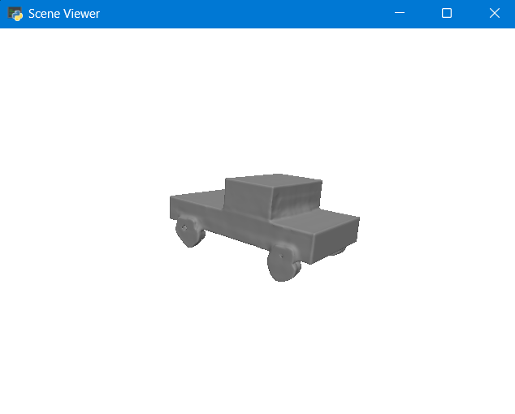
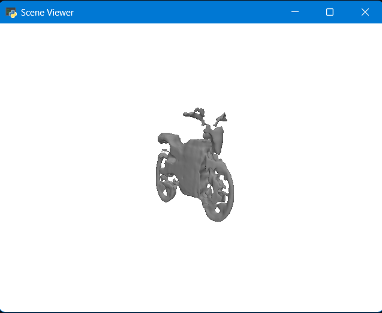

# 3D-Generator
My first instinct after reading the assignment was it would use some generation model which takes both text input as well as image input and converts them to 3D, but gpt gave me other approach it suggested that for image based generation i just map the edges and extrude them but that wouldn't be true 3D it would have been 2.5D.

So, i started my own research on different type  of models and endedup with mainly 2 open ai's Shap-e and tencent's Hunyuan3D-2 but after reading about both the models Shap-e fit the use case and provided sample code to refer from so that's the base model i use for this project.

But the problems didn't end there after my first successful run the visualization was not working turns out pytorch3D is not being recognised after debugging for hours I found that it some installation error so i switched to pyrender and made a fallback to trimesh.

# Usage
For text to 3D
```bash
python model_generator.py --input"a simple car"  --ouput car.obj
```
For image to 3D
```bash
python model_generator.py --input bike.jpeg --output bike.obj
```

# Example 
1.
```bash
python model_generator.py --input"a simple car"  --ouput car.obj
```
Output:


2.
```bash
python model_generator.py --input bike.jpeg --output bike.obj
```
Output:


# Libraries Used
PyTorch
Numpy
Maplotlib
Pillow
pyrenderer
PIL
trimesh
